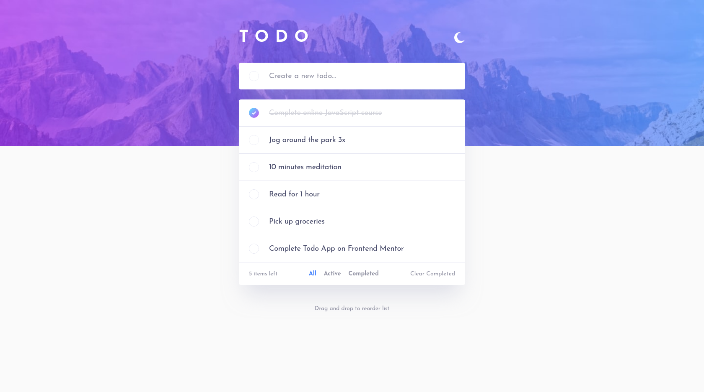
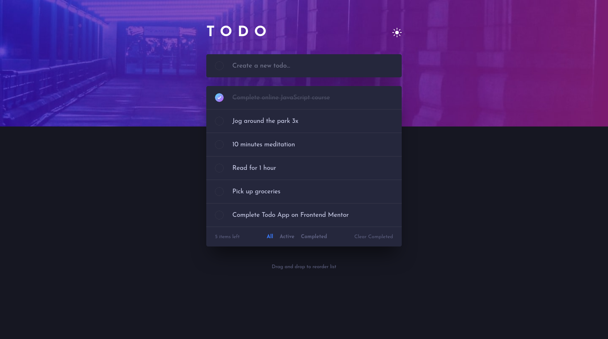
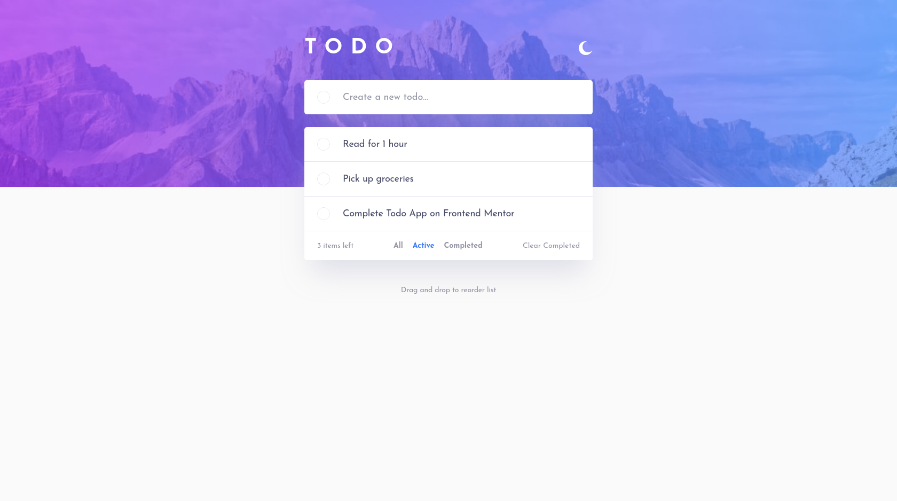
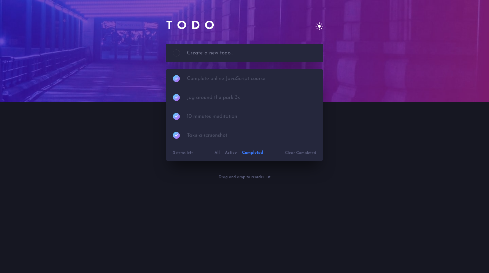
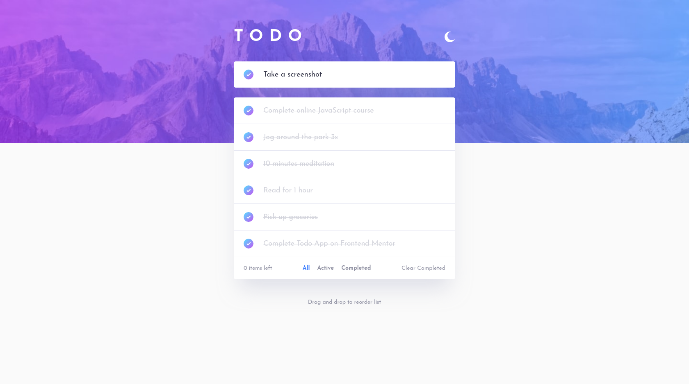
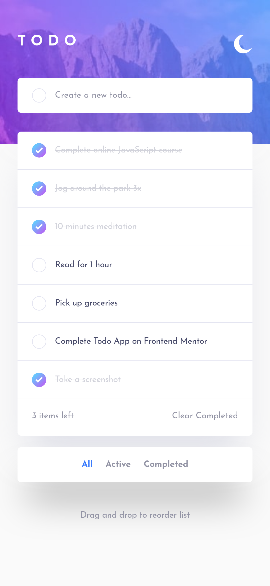
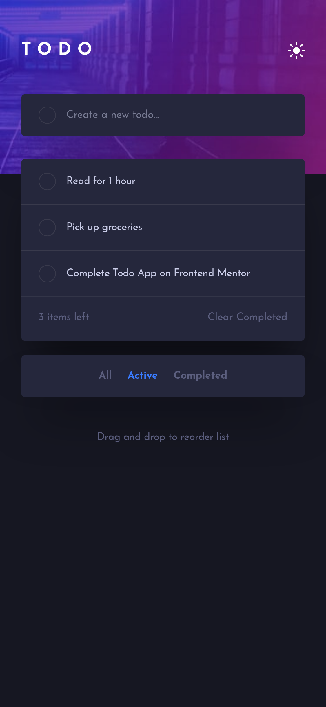
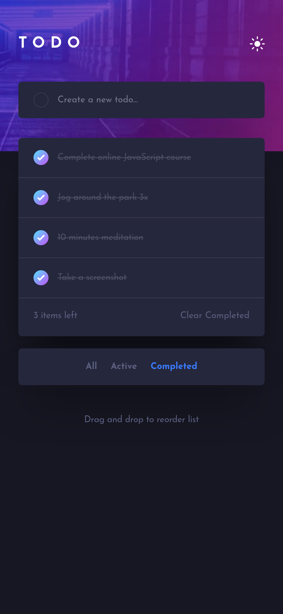

# Frontend Mentor - Todo app solution

This is a solution to the [Todo app challenge on Frontend Mentor](https://www.frontendmentor.io/challenges/todo-app-Su1_KokOW). Frontend Mentor challenges help you improve your coding skills by building realistic projects.

## Table of contents

- [Overview](#overview)
  - [The challenge](#the-challenge)
  - [Screenshot](#screenshot)
  - [Links](#links)
- [My process](#my-process)
  - [Built with](#built-with)
- [Author](#author)

## Overview

### The challenge

Users should be able to:

- View the optimal layout for the app depending on their device's screen size
- See hover states for all interactive elements on the page
- Add new todos to the list
- Mark todos as complete
- Delete todos from the list
- Filter by all/active/complete todos
- Clear all completed todos
- Toggle light and dark mode
- **Bonus**: Drag and drop to reorder items on the list

### Screenshot

  
Desktop

  
Mobile

### Links

- Solution URL: [Frontend Mentor Solution](https://www.frontendmentor.io/solutions/todo-app-using-react-js-scss-qKQjd95oB)
- Live Site URL: [Github Pages](https://rzvr.github.io/todo-app/)

### Built with

- Semantic HTML5 markup
- CSS/SCSS (BEM)
- JavaScript
- [React](https://reactjs.org/) - JS library

## Author

- Github - [rzvr](https://github.com/rzvr)
- Codewars - [rzvr](https://www.codewars.com/users/rzvr)
- LinkedIn - [Roman Zvir](https://www.linkedin.com/in/roman-zvir-8a4394214)
- Frontend Mentor - [rzvr](https://www.frontendmentor.io/profile/rzvr)
